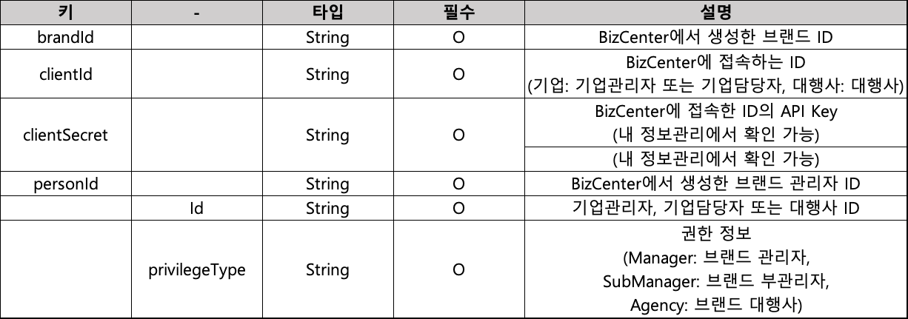

# 기업 전용 브랜드 관리

### 브랜드 등록 승인

* 기업관리자 계정을 이용하여 등록된 브랜드 승인을 요청합니다. 브랜드 등록 요청 시 1 개 이상의 발싞번호를 반드시 함께 등록해야 합니다. 브랜드 등록 시 필요한 브랜드 '프로필 이미지', 발신번호에 대한 '통신서비스 가입증명원'을 함께 등록해야 합니다. (브랜드 '백그라운드 이미지'는 선택사항)
* **POST** /rcsapi/v1/corp/brand/create
* Content-Type: multipart/form-data

**Request**

 (1).png>)

```json5
{
  "clientId": {},
  "clientSecret": {},
  "regBrand": {
    "name": {},
    "description": {},
    "tel": {},
    "menus": {
      "buttonType": {},
      "applink": {
        "packageName": {},
        "action": {},
        "uri": {}
      },
      "weblink": {}
    },
    "categoryId": {},
    "subCategoryId": {},
    "categoryOpt": {},
    "zipCode": {},
    "roadAddress": {},
    "detailAddress": {},
    "email": {},
    "webSiteUrl": {}
  },
  "brandProfile": {},
  "brandBackground": {},
  "mainMdn": {},
  "chatbots": {
    "mdn": {},
    "subnum": {},
    "subTitle": {},
    "rcsReply": {},
    "display": {},
    "service": {},
    "webhook": {}
  },
  "subNumCertificate": {}
}
```


**Response**

<table data-header-hidden><thead><tr><th width="150" align="center"></th><th width="153" align="center"></th><th width="150" align="center"></th><th width="276" align="center"></th></tr></thead><tbody><tr><td align="center"><strong>키</strong></td><td align="center"><strong>-</strong></td><td align="center"><strong>타입</strong></td><td align="center"><strong>설명</strong></td></tr><tr><td align="center">code</td><td align="center"></td><td align="center">String</td><td align="center">결과 코드</td></tr><tr><td align="center">message</td><td align="center"></td><td align="center">String</td><td align="center">실패 시 결과 메시지</td></tr><tr><td align="center">data</td><td align="center"></td><td align="center"></td><td align="center">성공 시 데이터</td></tr><tr><td align="center"></td><td align="center">brandId</td><td align="center">String</td><td align="center">메시지베이스 ID</td></tr><tr><td align="center">pagination</td><td align="center"></td><td align="center"></td><td align="center"></td></tr><tr><td align="center"></td><td align="center">limit</td><td align="center">Integer</td><td align="center">조회 최대 건수<br>(기본:100, 최대:1000)</td></tr><tr><td align="center"></td><td align="center">offset</td><td align="center">Integer</td><td align="center">시작 offset 번호 (기본:0)</td></tr><tr><td align="center"></td><td align="center">total</td><td align="center">Integer</td><td align="center">총 개수</td></tr></tbody></table>

### 브랜드 수정 승인

* 기업관리자 계정을 이용하여 승인 이력이 없는 브랜드를 수정 요청합니다.\
  승인을 요청 했으나 검수에서 반려되거나 RCS Biz Center 홈페이지에서 승인 요청하지 않고 저장한 브랜드 정보를 수정하여 승인 요청하는 경우 사용합니다.
* POST /rcsapi/v1/corp/brand/update
* Content-Type: multipart/form-data

**Request**

.png>)

```json5
{
  "clientId": {},
  "clientSecret": {},
  "brandId": {},
  "regBrand": {
    "name": {},
    "description": {},
    "tel": {},
    "menus": {
      "buttonType": {},
      "applink": {
        "packageName": {},
        "action": {},
        "uri": {}
      },
      "weblink": {}
    },
    "categoryId": {},
    "subCategoryId": {},
    "categoryOpt": {},
    "zipCode": {},
    "roadAddress": {},
    "detailAddress": {},
    "email": {},
    "webSiteUrl": {}
  },
  "brandProfile": {},
  "brandBackground": {},
  "mainMdn": {},
  "chatbots": {
    "mdn": {},
    "subnum": {},
    "subTitle": {},
    "rcsReply": {},
    "display": {},
    "service": {},
    "webhook": {}
  },
  "subNumCertificate": {}
}
```

**Response**

<table data-header-hidden><thead><tr><th width="150" align="center"></th><th width="153" align="center"></th><th width="150" align="center"></th><th width="276" align="center"></th></tr></thead><tbody><tr><td align="center"><strong>키</strong></td><td align="center"><strong>-</strong></td><td align="center"><strong>타입</strong></td><td align="center"><strong>설명</strong></td></tr><tr><td align="center">code</td><td align="center"></td><td align="center">String</td><td align="center">결과 코드</td></tr><tr><td align="center">message</td><td align="center"></td><td align="center">String</td><td align="center">실패 시 결과 메시지</td></tr><tr><td align="center">data</td><td align="center"></td><td align="center"></td><td align="center">성공 시 데이터</td></tr><tr><td align="center"></td><td align="center">brandId</td><td align="center">String</td><td align="center">메시지베이스 ID</td></tr><tr><td align="center">pagination</td><td align="center"></td><td align="center"></td><td align="center"></td></tr><tr><td align="center"></td><td align="center">limit</td><td align="center">Integer</td><td align="center">조회 최대 건수<br>(기본:100, 최대:1000)</td></tr><tr><td align="center"></td><td align="center">offset</td><td align="center">Integer</td><td align="center">시작 offset 번호 (기본:0)</td></tr><tr><td align="center"></td><td align="center">total</td><td align="center">Integer</td><td align="center">총 개수</td></tr></tbody></table>

### 브랜드 삭제

* 기업관리자 계정을 이용하여 승인 이력이 없는 브랜드를 삭제 요청합니다. 정상적으로 승인 요청된 브랜드는 승인 대기 상태가 되므로 삭제가 불가능합니다. (상태: 저장, 반려)
* **POST** /rcsapi/v1/corp/brand/remove
* Content-Type: application/json; charset=utf-8

**Request**

<table data-header-hidden><thead><tr><th width="181" align="center"></th><th width="150" align="center"></th><th width="150" align="center"></th><th width="261" align="center"></th></tr></thead><tbody><tr><td align="center"><strong>키</strong></td><td align="center"><strong>타입</strong></td><td align="center"><strong>필수</strong></td><td align="center"><strong>설명</strong></td></tr><tr><td align="center">clientId</td><td align="center">String</td><td align="center">O</td><td align="center">BizCenter 에 접속하는 ID<br>(기업: 기업관리자 또는 기업담당자, 대행사: 대행사)</td></tr><tr><td align="center">clientSecret</td><td align="center">String</td><td align="center">O</td><td align="center">BizCenter 에 접속한 ID 의 API Key (내 정보관리에서 확인 가능)</td></tr><tr><td align="center">brandId</td><td align="center">String</td><td align="center">O</td><td align="center">BizCenter 에서 생성한 브랜드 ID</td></tr></tbody></table>

**Response**

### 브랜드 상세 내용 조회

* 기업관리자, 기업담당자 계정으로 브랜드의 상세 내용을 조회합니다.
* **POST** /rcsapi/v1/corp/brand/info
* Content-Type: application/json; charset=utf-8

**Request**

<table data-header-hidden><thead><tr><th width="181" align="center"></th><th width="150" align="center"></th><th width="150" align="center"></th><th width="261" align="center"></th></tr></thead><tbody><tr><td align="center"><strong>키</strong></td><td align="center"><strong>타입</strong></td><td align="center"><strong>필수</strong></td><td align="center"><strong>설명</strong></td></tr><tr><td align="center">clientId</td><td align="center">String</td><td align="center">O</td><td align="center">BizCenter 에 접속하는 ID<br>(기업: 기업관리자 또는 기업담당자, 대행사: 대행사)</td></tr><tr><td align="center">clientSecret</td><td align="center">String</td><td align="center">O</td><td align="center">BizCenter 에 접속한 ID 의 API Key (내 정보관리에서 확인 가능)</td></tr><tr><td align="center">personId</td><td align="center">String</td><td align="center">O</td><td align="center">BizCenter 에서 생성한 브랜드 관리자 ID</td></tr><tr><td align="center">brandId</td><td align="center">String</td><td align="center">O</td><td align="center">BizCenter 에서 생성한 브랜드 ID</td></tr></tbody></table>

**Response**

<table data-header-hidden><thead><tr><th width="206" align="center"></th><th width="150" align="center"></th><th width="433" align="center"></th></tr></thead><tbody><tr><td align="center"><strong>키</strong></td><td align="center"><strong>타입</strong></td><td align="center"><strong>설명</strong></td></tr><tr><td align="center">code</td><td align="center">String</td><td align="center">결과 코드</td></tr><tr><td align="center">message</td><td align="center">String</td><td align="center">실패 시 결과 메시지</td></tr><tr><td align="center">data</td><td align="center"></td><td align="center">성공 시 데이터</td></tr><tr><td align="center">approvalDate</td><td align="center">String</td><td align="center">승인 일자</td></tr><tr><td align="center">brandId</td><td align="center">String</td><td align="center">브랜드 ID</td></tr><tr><td align="center">brandKey</td><td align="center">String</td><td align="center">브랜드 Key</td></tr><tr><td align="center">categoryOpt</td><td align="center">String</td><td align="center">검색용 키워드 임의 등록</td></tr><tr><td align="center">chatbotDate</td><td align="center">String</td><td align="center">챗봇 등록 일자</td></tr><tr><td align="center">description</td><td align="center">String</td><td align="center">브랜드 홈에 표시되는 브랜드 설정 </td></tr><tr><td align="center">detailAddress</td><td align="center">Object</td><td align="center">브랜드 홈에 표시되는 상세주소</td></tr><tr><td align="center">email</td><td align="center">String</td><td align="center">브랜드 홈에 표시되는 이메일주소</td></tr><tr><td align="center">mediaurl</td><td align="center">Array</td><td align="center">미디어 정보</td></tr><tr><td align="center">fieldId</td><td align="center">String</td><td align="center">미디어 파일 ID</td></tr><tr><td align="center">typeName</td><td align="center">String</td><td align="center">미디어 파일 타입 </td></tr><tr><td align="center">url</td><td align="center">String</td><td align="center">미디어 파일 URL 정보 </td></tr><tr><td align="center">menus</td><td align="center">Array</td><td align="center">메뉴 정보<br>(브랜드 홈에 최대 4개까지 표시, chat 은 기본 등록 되므로 지정할 수 있는 최대 menu는 3개이며, 등록 시 call을 포함하지 않고 2개 이하로 지정할 경우 call을 기본으로 추가합니다.)</td></tr><tr><td align="center">buttontype</td><td align="center">String</td><td align="center">챗봇 이름<br>(call, web, app, store, order, buy, tickets, moreinfo)</td></tr><tr><td align="center">applink</td><td align="center">Object</td><td align="center">APP Link 의 패키지 정보 </td></tr><tr><td align="center">packageName</td><td align="center">String</td><td align="center">APP 실행을 위한 패키지명</td></tr><tr><td align="center">action</td><td align="center">String</td><td align="center">APP 실행을 위한 Action</td></tr><tr><td align="center">uri</td><td align="center">String</td><td align="center">APP 실행을 위한 URI 정보</td></tr><tr><td align="center">weblink</td><td align="center">String</td><td align="center">buttonType call 을 제외한 모든 버튼은 Web URL 을 입력. http:// 또는 https://로 시작되어야 합니다.</td></tr><tr><td align="center">messagebaseDate</td><td align="center">String</td><td align="center">메시지베이스 일자</td></tr><tr><td align="center">name</td><td align="center">File</td><td align="center">브랜드 홈에 표시되는 브랜드 명</td></tr><tr><td align="center">registerDate</td><td align="center">String</td><td align="center">등록 일자</td></tr><tr><td align="center">roadAddress</td><td align="center">Array</td><td align="center">브랜드 홈에 표시되는 도로명주소</td></tr><tr><td align="center">status</td><td align="center">String</td><td align="center">브랜드 상태</td></tr><tr><td align="center">subCategoryId</td><td align="center">String</td><td align="center">하위 카테고리 ID</td></tr><tr><td align="center">subCategoryName</td><td align="center">String</td><td align="center">하위 카테고리 명</td></tr><tr><td align="center">tel</td><td align="center">String</td><td align="center">브랜드 홈에 노출될 전화번호 (대표 발신번호와 별개)</td></tr><tr><td align="center">updateDate</td><td align="center">String</td><td align="center">수정 일자</td></tr><tr><td align="center">webSiteUrl</td><td align="center">String</td><td align="center">브랜드 홈에 표시되는 홈페이지주소</td></tr><tr><td align="center">zipCode</td><td align="center">String</td><td align="center">브랜드 홈에 표시되는 우편번호</td></tr><tr><td align="center">pagination</td><td align="center"></td><td align="center"></td></tr><tr><td align="center">limit</td><td align="center">Integer</td><td align="center">조회 최대 건수 (기본:100, 최대:1000)</td></tr><tr><td align="center">offset</td><td align="center">Integer</td><td align="center">시작 offset 번호 (기본:0)</td></tr><tr><td align="center">total</td><td align="center">Integer</td><td align="center">총 개수</td></tr></tbody></table>

```json
{
  "code": {},
  "message": {},
  "data": {
    "approvalDate": {},
    "brandId": {},
    "brandKey": {},
    "categoryName": {},
    "categoryOpt": {},
    "chatbotDate": {},
    "description": {},
    "detailAddress": {},
    "email": {},
    "mediaurl": {
      "fieldId": {},
      "typeName": {},
      "url": {}
    },
    "menus": {
      "buttonType": {},
      "applink": {
        "packageName": {},
        "action": {},
        "uri": {}
      },
      "weblink": {}
    },
    "messagebaseDate": {},
    "name": {},
    "registerDate": {},
    "roadAddress": {},
    "status": {},
    "subCategoryId": {},
    "subCategoryName": {},
    "tel": {},
    "updateDate": {},
    "webSiteUrl": {},
    "zipCode": {}
  },
  "pagination": {
    "limit": {},
    "offset": {},
    "total": {}
  }
}
```


### 브랜드 카테고리 조회

* 브랜드 등록 시 사용 가능한 카테고리 목록을 조회합니다.
* POST /rcsapi/v1/corp/brand/categories
* Content-Type: application/json; charset=utf-8

**Request**

<table data-header-hidden><thead><tr><th width="181" align="center"></th><th width="150" align="center"></th><th width="150" align="center"></th><th width="261" align="center"></th></tr></thead><tbody><tr><td align="center"><strong>키</strong></td><td align="center"><strong>타입</strong></td><td align="center"><strong>필수</strong></td><td align="center"><strong>설명</strong></td></tr><tr><td align="center">clientId</td><td align="center">String</td><td align="center">O</td><td align="center">BizCenter 에 접속하는 ID<br>(기업: 기업관리자 또는 기업담당자, 대행사: 대행사)</td></tr><tr><td align="center">clientSecret</td><td align="center">String</td><td align="center">O</td><td align="center">BizCenter 에 접속한 ID 의 API Key (내 정보관리에서 확인 가능)</td></tr></tbody></table>

**Response**

 (1).png>)

### 권한 등록

* 브랜드 관리자 권한을 가진 기업관리자 계정으로 브랜드의 부 관리자 또는 대행사의 권한을 등록합니다.
* POST /rcsapi/v1/corp/brand/privilege/create
* Content-Type: application/json; charset=utf-8

**Request**

.png>)

**Response**

<table data-header-hidden><thead><tr><th width="150" align="center"></th><th width="153" align="center"></th><th width="150" align="center"></th><th width="276" align="center"></th></tr></thead><tbody><tr><td align="center"><strong>키</strong></td><td align="center"><strong>-</strong></td><td align="center"><strong>타입</strong></td><td align="center"><strong>설명</strong></td></tr><tr><td align="center">code</td><td align="center"></td><td align="center">String</td><td align="center">결과 코드</td></tr><tr><td align="center">message</td><td align="center"></td><td align="center">String</td><td align="center">실패 시 결과 메시지</td></tr><tr><td align="center">data</td><td align="center"></td><td align="center"></td><td align="center">성공 시 데이터</td></tr><tr><td align="center"></td><td align="center">Id</td><td align="center">String</td><td align="center">기업관리자, 기업담당자 또는 대행사 ID</td></tr><tr><td align="center"></td><td align="center">privilegeType</td><td align="center"></td><td align="center">권한 정보<br>(Manager: 브랜드 관리자, SubManager: 브랜드 부관리자, Agency: 브랜드 대행사)</td></tr><tr><td align="center"></td><td align="center">status</td><td align="center"></td><td align="center"><p>상태 정보</p><p>Waiting : RCS Biz Center 웹에서 제공되는 기능인 '브랜드 운영권한 신청’을 이용하여 신청 후 대기 브랜드 관리자의 승인을 대기 중인 상태. Waiting 상태의 대상은 POST 를 이용하여 등록하면 승인이 되고 OK 상태로 변경됨. </p><p>Processing : 권한 정보를 이통3사에 동기화 중인 경우 processing 상태로 표시. Processing 상태가 짧은 시간 동안 발생할 수 있으며 지속될 경우 RCS Biz Center 에 문의.</p><p>Ok: 권한 상태가 정상적인 경우 표시)</p></td></tr><tr><td align="center">pagination</td><td align="center"></td><td align="center"></td><td align="center"></td></tr><tr><td align="center"></td><td align="center">limit</td><td align="center">Integer</td><td align="center">조회 최대 건수<br>(기본:100, 최대:1000)</td></tr><tr><td align="center"></td><td align="center">offset</td><td align="center">Integer</td><td align="center">시작 offset 번호 (기본:0)</td></tr><tr><td align="center"></td><td align="center">total</td><td align="center">Integer</td><td align="center">총 개수</td></tr></tbody></table>

### 권한 위임

* 브랜드 관리자 권한을 기업관리자에게 위임합니다.\
  브랜드 관리자 권한을 지정된 브랜드 관리자로 변경 시, 기존 브랜드 관리자는 브랜드 부 관리자로 변경됩니다.
* **POST** /rcsapi/v1/corp/brand/privilege/update
* Content-Type: application/json; charset=utf-8

**Request**



**Response**

<table data-header-hidden><thead><tr><th width="150" align="center"></th><th width="153" align="center"></th><th width="150" align="center"></th><th width="276" align="center"></th></tr></thead><tbody><tr><td align="center"><strong>키</strong></td><td align="center"><strong>-</strong></td><td align="center"><strong>타입</strong></td><td align="center"><strong>설명</strong></td></tr><tr><td align="center">code</td><td align="center"></td><td align="center">String</td><td align="center">결과 코드</td></tr><tr><td align="center">message</td><td align="center"></td><td align="center">String</td><td align="center">실패 시 결과 메시지</td></tr><tr><td align="center">data</td><td align="center"></td><td align="center"></td><td align="center">성공 시 데이터</td></tr><tr><td align="center"></td><td align="center">Id</td><td align="center">String</td><td align="center">기업관리자, 기업담당자 또는 대행사 ID</td></tr><tr><td align="center"></td><td align="center">privilegeType</td><td align="center"></td><td align="center">권한 정보 (Manager: 브랜드 관리자, SubManager: 브랜드 부관리자, Agency: 브랜드 대행사)</td></tr><tr><td align="center"></td><td align="center">status</td><td align="center"></td><td align="center"><p>상태 정보</p><p>Waiting : RCS Biz Center 웹에서 제공되는 기능인 '브랜드 운영권한 신청’을 이용하여 신청 후 대기 브랜드 관리자의 승인을 대기 중인 상태. Waiting 상태의 대상은 POST 를 이용하여 등록하면 승인이 되고 OK 상태로 변경됨. </p><p>Processing : 권한 정보를 이통3사에 동기화 중인 경우 processing 상태로 표시. Processing 상태가 짧은 시간 동안 발생할 수 있으며 지속될 경우 RCS Biz Center 에 문의.</p><p>Ok: 권한 상태가 정상적인 경우 표시)</p></td></tr><tr><td align="center">pagination</td><td align="center"></td><td align="center"></td><td align="center"></td></tr><tr><td align="center"></td><td align="center">limit</td><td align="center">Integer</td><td align="center">조회 최대 건수<br>(기본:100, 최대:1000)</td></tr><tr><td align="center"></td><td align="center">offset</td><td align="center">Integer</td><td align="center">시작 offset 번호 (기본:0)</td></tr><tr><td align="center"></td><td align="center">total</td><td align="center">Integer</td><td align="center">총 개수</td></tr></tbody></table>

### 권한 삭제

* 브랜드 부관리자, 대행사 권한 중 지정한 대상의 권한을 삭제합니다.\
  브랜드 관리자는 삭제할 수 없으며 브랜드 관리자를 변경하고자 할 경우 **권한 위임** API 를 사용해야 합니다.
* **POST** /rcsapi/v1/corp/brand/privilege/remove
* Content-Type: application/json; charset=utf-8

**Request**

<table data-header-hidden><thead><tr><th width="153" align="center"></th><th width="150" align="center"></th><th width="150" align="center"></th><th width="297" align="center"></th></tr></thead><tbody><tr><td align="center"><strong>키</strong></td><td align="center"><strong>타입</strong></td><td align="center"><strong>필수</strong></td><td align="center"><strong>설명</strong></td></tr><tr><td align="center">brandId</td><td align="center">String</td><td align="center">O</td><td align="center">BizCenter 에서 생성한 브랜드 ID</td></tr><tr><td align="center">clientId</td><td align="center">String</td><td align="center">O</td><td align="center">BizCenter 에 접속하는 ID<br>(기업: 기업관리자 또는 기업담당자, <br>대행사: 대행사)</td></tr><tr><td align="center">clientSecret</td><td align="center">String</td><td align="center">O</td><td align="center">BizCenter 에 접속한 ID 의 API Key <br>(내 정보관리에서 확인 가능)</td></tr><tr><td align="center">personId</td><td align="center">String</td><td align="center">O</td><td align="center">BizCenter 에서 생성한 브랜드 관리자 ID</td></tr><tr><td align="center">id</td><td align="center">String</td><td align="center">O</td><td align="center">브랜드 부관리자 또는 대행사 ID</td></tr></tbody></table>

**Response**

<table data-header-hidden><thead><tr><th width="150" align="center"></th><th width="153" align="center"></th><th width="150" align="center"></th><th width="276" align="center"></th></tr></thead><tbody><tr><td align="center"><strong>키</strong></td><td align="center"><strong>-</strong></td><td align="center"><strong>타입</strong></td><td align="center"><strong>설명</strong></td></tr><tr><td align="center">code</td><td align="center"></td><td align="center">String</td><td align="center">결과 코드</td></tr><tr><td align="center">message</td><td align="center"></td><td align="center">String</td><td align="center">실패 시 결과 메시지</td></tr><tr><td align="center">data</td><td align="center"></td><td align="center"></td><td align="center">성공 시 데이터</td></tr><tr><td align="center"></td><td align="center">Id</td><td align="center">String</td><td align="center">기업관리자, 기업담당자 또는 대행사 ID</td></tr><tr><td align="center"></td><td align="center">privilegeType</td><td align="center"></td><td align="center">권한 정보 (Manager: 브랜드 관리자, SubManager: 브랜드 부관리자, Agency: 브랜드 대행사)</td></tr><tr><td align="center"></td><td align="center">status</td><td align="center"></td><td align="center"><p>상태 정보</p><p>Waiting : RCS Biz Center 웹에서 제공되는 기능인 '브랜드 운영권한 신청’을 이용하여 신청 후 대기 브랜드 관리자의 승인을 대기 중인 상태. Waiting 상태의 대상은 POST 를 이용하여 등록하면 승인이 되고 OK 상태로 변경됨. </p><p>Processing : 권한 정보를 이통3사에 동기화 중인 경우 processing 상태로 표시. Processing 상태가 짧은 시간 동안 발생할 수 있으며 지속될 경우 RCS Biz Center 에 문의.</p><p>Ok: 권한 상태가 정상적인 경우 표시)</p></td></tr><tr><td align="center">pagination</td><td align="center"></td><td align="center"></td><td align="center"></td></tr><tr><td align="center"></td><td align="center">limit</td><td align="center">Integer</td><td align="center">조회 최대 건수<br>(기본:100, 최대:1000)</td></tr><tr><td align="center"></td><td align="center">offset</td><td align="center">Integer</td><td align="center">시작 offset 번호 (기본:0)</td></tr><tr><td align="center"></td><td align="center">total</td><td align="center">Integer</td><td align="center">총 개수</td></tr></tbody></table>

### 권한 조회

* 브랜드에 등록된 운영 권한 정보를 조회합니다.
* **POST** /rcsapi/v1/corp/brand/privilege/list
* Content-Type: application/json; charset=utf-8

**Request**

<table data-header-hidden><thead><tr><th width="153" align="center"></th><th width="150" align="center"></th><th width="150" align="center"></th><th width="297" align="center"></th></tr></thead><tbody><tr><td align="center"><strong>키</strong></td><td align="center"><strong>타입</strong></td><td align="center"><strong>필수</strong></td><td align="center"><strong>설명</strong></td></tr><tr><td align="center">brandId</td><td align="center">String</td><td align="center">O</td><td align="center">BizCenter 에서 생성한 브랜드 ID</td></tr><tr><td align="center">clientId</td><td align="center">String</td><td align="center">O</td><td align="center">BizCenter 에 접속하는 ID<br>(기업: 기업관리자 또는 기업담당자, <br>대행사: 대행사)</td></tr><tr><td align="center">clientSecret</td><td align="center">String</td><td align="center">O</td><td align="center">BizCenter 에 접속한 ID 의 API Key <br>(내 정보관리에서 확인 가능)</td></tr><tr><td align="center">personId</td><td align="center">String</td><td align="center">O</td><td align="center">BizCenter 에서 생성한 브랜드 관리자 ID</td></tr></tbody></table>

**Response**

<table data-header-hidden><thead><tr><th width="150" align="center"></th><th width="153" align="center"></th><th width="150" align="center"></th><th width="276" align="center"></th></tr></thead><tbody><tr><td align="center"><strong>키</strong></td><td align="center"><strong>-</strong></td><td align="center"><strong>타입</strong></td><td align="center"><strong>설명</strong></td></tr><tr><td align="center">code</td><td align="center"></td><td align="center">String</td><td align="center">결과 코드</td></tr><tr><td align="center">message</td><td align="center"></td><td align="center">String</td><td align="center">실패 시 결과 메시지</td></tr><tr><td align="center">data</td><td align="center"></td><td align="center"></td><td align="center">성공 시 데이터</td></tr><tr><td align="center"></td><td align="center">Id</td><td align="center">String</td><td align="center">기업관리자, 기업담당자 또는 대행사 ID</td></tr><tr><td align="center"></td><td align="center">privilegeType</td><td align="center"></td><td align="center">권한 정보 (Manager: 브랜드 관리자, SubManager: 브랜드 부관리자, Agency: 브랜드 대행사)</td></tr><tr><td align="center"></td><td align="center">status</td><td align="center"></td><td align="center"><p>상태 정보</p><p>Waiting : RCS Biz Center 웹에서 제공되는 기능인 '브랜드 운영권한 신청’을 이용하여 신청 후 대기 브랜드 관리자의 승인을 대기 중인 상태.<br>Waiting 상태의 대상은 POST 를 이용하여 등록하면 승인이 되고 OK 상태로 변경됨. </p><p>Processing : 권한 정보를 이통3사에 동기화 중인 경우 processing 상태로 표시. <br>Processing 상태가 짧은 시간 동안 발생할 수 있으며 지속될 경우 RCS Biz Center 에 문의.</p><p>Ok: 권한 상태가 정상적인 경우 표시)</p></td></tr><tr><td align="center">pagination</td><td align="center"></td><td align="center"></td><td align="center"></td></tr><tr><td align="center"></td><td align="center">limit</td><td align="center">Integer</td><td align="center">조회 최대 건수<br>(기본:100, 최대:1000)</td></tr><tr><td align="center"></td><td align="center">offset</td><td align="center">Integer</td><td align="center">시작 offset 번호 (기본:0)</td></tr><tr><td align="center"></td><td align="center">total</td><td align="center">Integer</td><td align="center">총 개수</td></tr></tbody></table>

### 운영중인 브랜드 정보 수정

* 기업관리자 계정을 이용하여 현재 운영 중인 브랜드 정보를 수정합니다. 브랜드의 권한이 브랜드 관리자 또는 브랜드 부관리자일 경우에만 수정이 가능합니다. 브랜드명 또는 프로필 이미지가 수정될 경우 재 승인이 필요하며, 상태는 승인대기로 변경됩니다. (이외는 별도 승인 과정이 없음)
* **POST** /rcsapi/v1/corp/brand/update
* Content-Type: multipart/form-data

**Request**

.png>)

```json5
{
  "clientId": {},
  "clientSecret": {},
  "brandId": {},
  "personId": {},
  "regBrand": {
    "name": {},
    "description": {},
    "tel": {},
    "menus": {
      "buttonType": {},
      "applink": {
        "packageName": {},
        "action": {},
        "uri": {}
      },
      "weblink": {}
    },
    "categoryId": {},
    "subCategoryId": {},
    "categoryOpt": {},
    "zipCode": {},
    "roadAddress": {},
    "detailAddress": {},
    "email": {},
    "webSiteUrl": {}
  },
  "brandProfile": {},
  "brandBackground": {},
  "mainMdn": {},
  "chatbots": {
    "mdn": {},
    "subnum": {},
    "subTitle": {},
    "rcsReply": {},
    "display": {},
    "service": {},
    "webhook": {}
  },
  "subNumCertificate": {}
}
```

**Response**

<table data-header-hidden><thead><tr><th width="206" align="center"></th><th width="150" align="center"></th><th width="433" align="center"></th></tr></thead><tbody><tr><td align="center"><strong>키</strong></td><td align="center"><strong>타입</strong></td><td align="center"><strong>설명</strong></td></tr><tr><td align="center">code</td><td align="center">String</td><td align="center">결과 코드</td></tr><tr><td align="center">message</td><td align="center">String</td><td align="center">실패 시 결과 메시지</td></tr><tr><td align="center">data</td><td align="center"></td><td align="center">성공 시 데이터</td></tr><tr><td align="center">approvalDate</td><td align="center">String</td><td align="center">승인 일자</td></tr><tr><td align="center">brandId</td><td align="center">String</td><td align="center">브랜드 ID</td></tr><tr><td align="center">brandKey</td><td align="center">String</td><td align="center">브랜드 Key</td></tr><tr><td align="center">categoryOpt</td><td align="center">String</td><td align="center">검색용 키워드 임의 등록</td></tr><tr><td align="center">chatbotDate</td><td align="center">String</td><td align="center">챗봇 등록 일자</td></tr><tr><td align="center">description</td><td align="center">String</td><td align="center">브랜드 홈에 표시되는 브랜드 설명 </td></tr><tr><td align="center">detailAddress</td><td align="center">Object</td><td align="center">브랜드 홈에 표시되는 상세주소</td></tr><tr><td align="center">email</td><td align="center">String</td><td align="center">브랜드 홈에 표시되는 이메일주소</td></tr><tr><td align="center">mediaurl</td><td align="center">Array</td><td align="center">미디어 정보</td></tr><tr><td align="center">fieldId</td><td align="center">String</td><td align="center">미디어 파일 ID</td></tr><tr><td align="center">typeName</td><td align="center">String</td><td align="center">미디어 파일 타입 </td></tr><tr><td align="center">url</td><td align="center">String</td><td align="center">미디어 파일 URL 정보 </td></tr><tr><td align="center">menus</td><td align="center">Array</td><td align="center">메뉴 정보<br>(브랜드 홈에 최대 4개까지 표시, chat 은 기본 등록 되므로 지정할 수 있는 최대 menu는 3개이며, 등록 시 call을 포함하지 않고 2개 이하로 지정할 경우 call을 기본으로 추가합니다.)</td></tr><tr><td align="center">buttonType</td><td align="center">String</td><td align="center">챗봇 이름<br>(call, web, app, store, order, buy, tickets, moreinfo)</td></tr><tr><td align="center">applink</td><td align="center">Object</td><td align="center">APP Link 의 패키지 정보 </td></tr><tr><td align="center">packageName</td><td align="center">String</td><td align="center">APP 실행을 위한 패키지명</td></tr><tr><td align="center">action</td><td align="center">String</td><td align="center">APP 실행을 위한 Action</td></tr><tr><td align="center">uri</td><td align="center">String</td><td align="center">APP 실행을 위한 URI 정보</td></tr><tr><td align="center">weblink</td><td align="center">String</td><td align="center">buttonType call 을 제외한 모든 버튼은 Web URL 을 입력. http:// 또는 https://로 시작되어야 합니다.</td></tr><tr><td align="center">messagebaseDate</td><td align="center">String</td><td align="center">메시지베이스 일자</td></tr><tr><td align="center">name</td><td align="center">File</td><td align="center">브랜드 홈에 표시되는 브랜드 명</td></tr><tr><td align="center">registerDate</td><td align="center">String</td><td align="center">등록 일자</td></tr><tr><td align="center">roadAddress</td><td align="center">Array</td><td align="center">브랜드 홈에 표시되는 도로명주소</td></tr><tr><td align="center">status</td><td align="center">String</td><td align="center">브랜드 상태</td></tr><tr><td align="center">subCategoryId</td><td align="center">String</td><td align="center">하위 카테고리 ID</td></tr><tr><td align="center">subCategoryName</td><td align="center">String</td><td align="center">하위 카테고리 명</td></tr><tr><td align="center">tel</td><td align="center">String</td><td align="center">브랜드 홈에 노출될 전화번호 (대표 발신번호와 별개)</td></tr><tr><td align="center">updateDate</td><td align="center">String</td><td align="center">수정 일자</td></tr><tr><td align="center">webSiteUrl</td><td align="center">String</td><td align="center">브랜드 홈에 표시되는 홈페이지 주소</td></tr><tr><td align="center">zipCode</td><td align="center">String</td><td align="center">브랜드 홈에 표시되는 우편번호</td></tr><tr><td align="center">pagination</td><td align="center"></td><td align="center"></td></tr><tr><td align="center">limit</td><td align="center">Integer</td><td align="center">조회 최대 건수 (기본:100, 최대:1000)</td></tr><tr><td align="center">offset</td><td align="center">Integer</td><td align="center">시작 offset 번호 (기본:0)</td></tr><tr><td align="center">total</td><td align="center">Integer</td><td align="center">총 개수</td></tr></tbody></table>

```json5
{
  "code": {},
  "message": {},
  "data": {
    "approvalDate": {},
    "brandId": {},
    "brandKey": {},
    "categoryName": {},
    "categoryOpt": {},
    "chatbotDate": {},
    "description": {},
    "detailAddress": {},
    "email": {},
    "mediaurl": {
      "fieldId": {},
      "typeName": {},
      "url": {}
    },
    "menus": {
      "buttonType": {},
      "applink": {
        "packageName": {},
        "action": {},
        "uri": {}
      },
      "weblink": {}
    },
    "messagebaseDate": {},
    "name": {},
    "registerDate": {},
    "roadAddress": {},
    "status": {},
    "subCategoryId": {},
    "subCategoryName": {},
    "tel": {},
    "updateDate": {},
    "webSiteUrl": {},
    "zipCode": {}
  },
  "pagination": {
    "limit": {},
    "offset": {},
    "total": {}
  }
}json
```


### 승인된 브랜드 삭제

* 기업관리자 계정을 이용하여 승인된 브랜드를 삭제 요청합니다. 브랜드 삭제를 위해서는 토큰 발급 계정과 personId 가 동일해야 하며 brandId 에 대한 브랜드 관리자 권한을 가져야 합니다. 반려, 저장 상태의 브랜드는 즉시 삭제가 가능하지만 승인 후 사용중인 브랜드의 경우에는 브랜드에 등록된 발싞번호, 템플릿을 먼저 삭제한 후에 삭제가 가능합니다.
* POST /rcsapi/v1/corp/brand/remove
* Content-Type: application/json; charset=utf-8

**Request**

<table data-header-hidden><thead><tr><th width="153" align="center"></th><th width="150" align="center"></th><th width="150" align="center"></th><th width="297" align="center"></th></tr></thead><tbody><tr><td align="center"><strong>키</strong></td><td align="center"><strong>타입</strong></td><td align="center"><strong>필수</strong></td><td align="center"><strong>설명</strong></td></tr><tr><td align="center">brandId</td><td align="center">String</td><td align="center">O</td><td align="center">BizCenter 에서 생성한 브랜드 ID</td></tr><tr><td align="center">clientId</td><td align="center">String</td><td align="center">O</td><td align="center">BizCenter 에 접속하는 ID<br>(기업: 기업관리자 또는 기업담당자, <br>대행사: 대행사)</td></tr><tr><td align="center">clientSecret</td><td align="center">String</td><td align="center">O</td><td align="center">BizCenter 에 접속한 ID 의 API Key <br>(내 정보관리에서 확인 가능)</td></tr><tr><td align="center">personId</td><td align="center">String</td><td align="center">O</td><td align="center">BizCenter 에서 생성한 브랜드 관리자 ID</td></tr></tbody></table>

**Response**

<table data-header-hidden><thead><tr><th width="150" align="center"></th><th width="153" align="center"></th><th width="150" align="center"></th><th width="276" align="center"></th></tr></thead><tbody><tr><td align="center"><strong>키</strong></td><td align="center"><strong>-</strong></td><td align="center"><strong>타입</strong></td><td align="center"><strong>설명</strong></td></tr><tr><td align="center">code</td><td align="center"></td><td align="center">String</td><td align="center">결과 코드</td></tr><tr><td align="center">message</td><td align="center"></td><td align="center">String</td><td align="center">실패 시 결과 메시지</td></tr><tr><td align="center">data</td><td align="center"></td><td align="center"></td><td align="center">성공 시 데이터</td></tr><tr><td align="center"></td><td align="center">brandId</td><td align="center">String</td><td align="center">브랜드 ID</td></tr><tr><td align="center">pagination</td><td align="center"></td><td align="center"></td><td align="center"></td></tr><tr><td align="center"></td><td align="center">limit</td><td align="center">Integer</td><td align="center">조회 최대 건수<br>(기본:100, 최대:1000)</td></tr><tr><td align="center"></td><td align="center">offset</td><td align="center">Integer</td><td align="center">시작 offset 번호 (기본:0)</td></tr><tr><td align="center"></td><td align="center">total</td><td align="center">Integer</td><td align="center">총 개수</td></tr></tbody></table>
