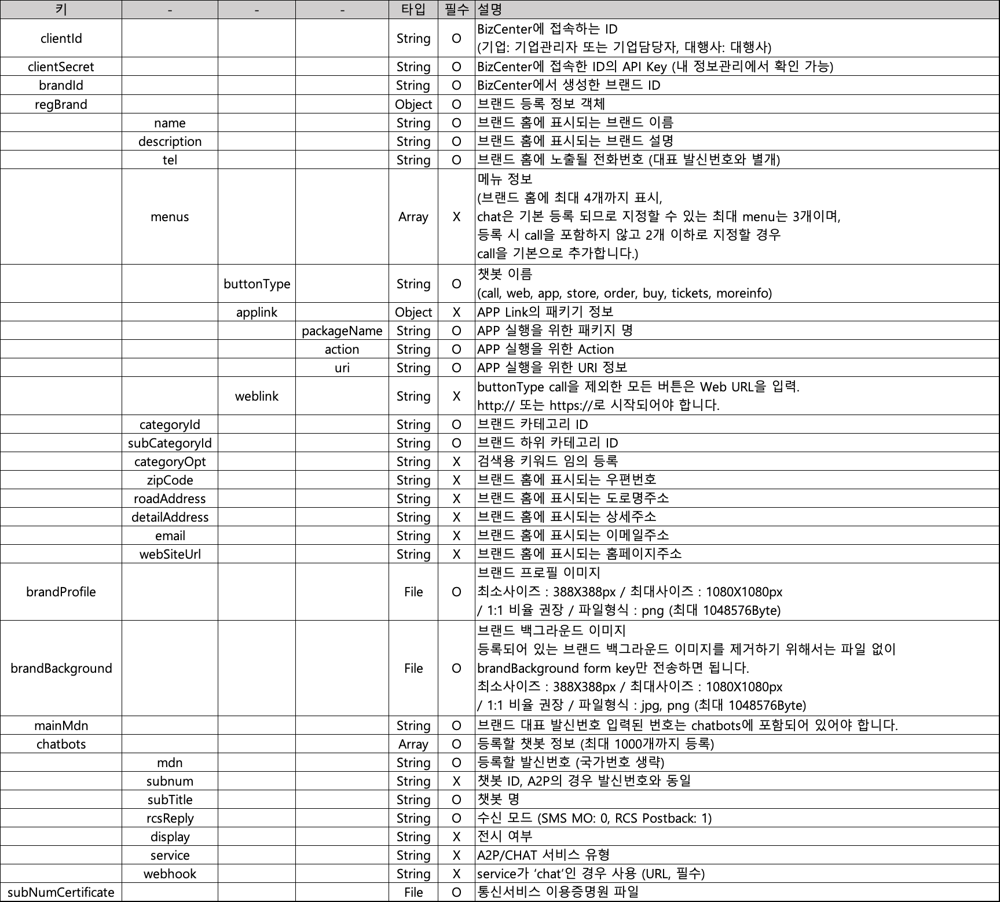

# 기업 전용 브랜드 관리

### 브랜드 등록 승인

* 기업관리자 계정을 이용하여 등록된 브랜드 승인을 요청합니다. 브랜드 등록 요청 시 1 개 이상의 발싞번호를 반드시 함께 등록해야 합니다. 브랜드 등록 시 필요한 브랜드 '프로필 이미지', 발신번호에 대한 '통신서비스 가입증명원'을 함께 등록해야 합니다. (브랜드 '백그라운드 이미지'는 선택사항)
* **POST** /rcsapi/v1/corp/brand/create
* Content-Type: multipart/form-data

**Request**

.png>)

```json5
{
  "clientId": {},
  "clientSecret": {},
  "regBrand": {
    "name": {},
    "description": {},
    "tel": {},
    "menus": {
      "buttonType": {},
      "applink": {
        "packageName": {},
        "action": {},
        "uri": {}
      },
      "weblink": {}
    },
    "categoryId": {},
    "subCategoryId": {},
    "categoryOpt": {},
    "zipCode": {},
    "roadAddress": {},
    "detailAddress": {},
    "email": {},
    "webSiteUrl": {}
  },
  "brandProfile": {},
  "brandBackground": {},
  "mainMdn": {},
  "chatbots": {
    "mdn": {},
    "subnum": {},
    "subTitle": {},
    "rcsReply": {},
    "display": {},
    "service": {},
    "webhook": {}
  },
  "subNumCertificate": {}
}
```

****

**Response**

|    **키**   |  **-**  |  **타입** |                         **설명**                        |
| :--------: | :-----: | :-----: | :---------------------------------------------------: |
|    code    |         |  String |                         결과 코드                         |
|   message  |         |  String |                      실패 시 결과 메시지                      |
|    data    |         |         |                        성공 시 데이터                       |
|            | brandId |  String |                       메시지베이스 ID                       |
| pagination |         |         |                                                       |
|            |  limit  | Integer | <p>조회 최대 건수<br><strong></strong>(기본:100, 최대:1000)</p> |
|            |  offset | Integer |                  시작 offset 번호 (기본:0)                  |
|            |  total  | Integer |                          총 개수                         |

### 브랜드 수정 승인

* 기업관리자 계정을 이용하여 승인 이력이 없는 브랜드를 수정 요청합니다.\
  승인을 요청 했으나 검수에서 반려되거나 RCS Biz Center 홈페이지에서 승인 요청하지 않고 저장한 브랜드 정보를 수정하여 승인 요청하는 경우 사용합니다.
* POST /rcsapi/v1/corp/brand/update
* Content-Type: multipart/form-data

**Request**



```json5
{
  "clientId": {},
  "clientSecret": {},
  "brandId": {},
  "regBrand": {
    "name": {},
    "description": {},
    "tel": {},
    "menus": {
      "buttonType": {},
      "applink": {
        "packageName": {},
        "action": {},
        "uri": {}
      },
      "weblink": {}
    },
    "categoryId": {},
    "subCategoryId": {},
    "categoryOpt": {},
    "zipCode": {},
    "roadAddress": {},
    "detailAddress": {},
    "email": {},
    "webSiteUrl": {}
  },
  "brandProfile": {},
  "brandBackground": {},
  "mainMdn": {},
  "chatbots": {
    "mdn": {},
    "subnum": {},
    "subTitle": {},
    "rcsReply": {},
    "display": {},
    "service": {},
    "webhook": {}
  },
  "subNumCertificate": {}
}
```

**Response**

|    **키**   |  **-**  |  **타입** |                         **설명**                        |
| :--------: | :-----: | :-----: | :---------------------------------------------------: |
|    code    |         |  String |                         결과 코드                         |
|   message  |         |  String |                      실패 시 결과 메시지                      |
|    data    |         |         |                        성공 시 데이터                       |
|            | brandId |  String |                       메시지베이스 ID                       |
| pagination |         |         |                                                       |
|            |  limit  | Integer | <p>조회 최대 건수<br><strong></strong>(기본:100, 최대:1000)</p> |
|            |  offset | Integer |                  시작 offset 번호 (기본:0)                  |
|            |  total  | Integer |                          총 개수                         |

### 브랜드 삭제

* 기업관리자 계정을 이용하여 승인 이력이 없는 브랜드를 삭제 요청합니다. 정상적으로 승인 요청된 브랜드는 승인 대기 상태가 되므로 삭제가 불가능합니다. (상태: 저장, 반려)
* **POST** /rcsapi/v1/corp/brand/remove
* Content-Type: application/json; charset=utf-8

**Request**

|     **키**    | **타입** | **필수** |                            **설명**                            |
| :----------: | :----: | :----: | :----------------------------------------------------------: |
|   clientId   | String |    O   | <p>BizCenter 에 접속하는 ID<br>(기업: 기업관리자 또는 기업담당자, 대행사: 대행사)</p> |
| clientSecret | String |    O   |         BizCenter 에 접속한 ID 의 API Key (내 정보관리에서 확인 가능)        |
|    brandId   | String |    O   |                    BizCenter 에서 생성한 브랜드 ID                   |

**Response**

### 브랜드 상세 내용 조회

* 기업관리자, 기업담당자 계정으로 브랜드의 상세 내용을 조회합니다.
* **POST** /rcsapi/v1/corp/brand/info
* Content-Type: application/json; charset=utf-8

**Request**

|     **키**    | **타입** | **필수** |                            **설명**                            |
| :----------: | :----: | :----: | :----------------------------------------------------------: |
|   clientId   | String |    O   | <p>BizCenter 에 접속하는 ID<br>(기업: 기업관리자 또는 기업담당자, 대행사: 대행사)</p> |
| clientSecret | String |    O   |         BizCenter 에 접속한 ID 의 API Key (내 정보관리에서 확인 가능)        |
|   personId   | String |    O   |                  BizCenter 에서 생성한 브랜드 관리자 ID                 |
|    brandId   | String |    O   |                    BizCenter 에서 생성한 브랜드 ID                   |

**Response**

|      **키**      |  **타입** |                                                              **설명**                                                              |
| :-------------: | :-----: | :------------------------------------------------------------------------------------------------------------------------------: |
|       code      |  String |                                                               결과 코드                                                              |
|     message     |  String |                                                            실패 시 결과 메시지                                                           |
|       data      |         |                                                             성공 시 데이터                                                             |
|   approvalDate  |  String |                                                               승인 일자                                                              |
|     brandId     |  String |                                                              브랜드 ID                                                              |
|     brandKey    |  String |                                                              브랜드 Key                                                             |
|   categoryOpt   |  String |                                                           검색용 키워드 임의 등록                                                          |
|   chatbotDate   |  String |                                                             챗봇 등록 일자                                                             |
|   description   |  String |                                                        브랜드 홈에 표시되는 브랜드 설정                                                        |
|  detailAddress  |  Object |                                                         브랜드 홈에 표시되는 상세주소                                                         |
|      email      |  String |                                                         브랜드 홈에 표시되는 이메일주소                                                        |
|     mediaurl    |  Array  |                                                              미디어 정보                                                              |
|     fieldId     |  String |                                                             미디어 파일 ID                                                            |
|     typeName    |  String |                                                            미디어 파일 타입                                                             |
|       url       |  String |                                                          미디어 파일 URL 정보                                                           |
|      menus      |  Array  | <p>메뉴 정보<br>(브랜드 홈에 최대 4개까지 표시, chat 은 기본 등록 되므로 지정할 수 있는 최대 menu는 3개이며, 등록 시 call을 포함하지 않고 2개 이하로 지정할 경우 call을 기본으로 추가합니다.)</p> |
|    buttontype   |  String |                              <p>챗봇 이름<br>(call, web, app, store, order, buy, tickets, moreinfo)</p>                              |
|     applink     |  Object |                                                        APP Link 의 패키지 정보                                                         |
|   packageName   |  String |                                                          APP 실행을 위한 패키지명                                                         |
|      action     |  String |                                                         APP 실행을 위한 Action                                                        |
|       uri       |  String |                                                         APP 실행을 위한 URI 정보                                                        |
|     weblink     |  String |                            buttonType call 을 제외한 모든 버튼은 Web URL 을 입력. http:// 또는 https://로 시작되어야 합니다.                            |
| messagebaseDate |  String |                                                             메시지베이스 일자                                                            |
|       name      |   File  |                                                         브랜드 홈에 표시되는 브랜드 명                                                        |
|   registerDate  |  String |                                                               등록 일자                                                              |
|   roadAddress   |  Array  |                                                         브랜드 홈에 표시되는 도로명주소                                                        |
|      status     |  String |                                                              브랜드 상태                                                              |
|  subCategoryId  |  String |                                                            하위 카테고리 ID                                                            |
| subCategoryName |  String |                                                             하위 카테고리 명                                                            |
|       tel       |  String |                                                   브랜드 홈에 노출될 전화번호 (대표 발신번호와 별개)                                                  |
|    updateDate   |  String |                                                               수정 일자                                                              |
|    webSiteUrl   |  String |                                                        브랜드 홈에 표시되는 홈페이지주소                                                        |
|     zipCode     |  String |                                                         브랜드 홈에 표시되는 우편번호                                                         |
|    pagination   |         |                                                                                                                                  |
|      limit      | Integer |                                                    조회 최대 건수 (기본:100, 최대:1000)                                                    |
|      offset     | Integer |                                                        시작 offset 번호 (기본:0)                                                       |
|      total      | Integer |                                                               총 개수                                                               |

```json
{
  "code": {},
  "message": {},
  "data": {
    "approvalDate": {},
    "brandId": {},
    "brandKey": {},
    "categoryName": {},
    "categoryOpt": {},
    "chatbotDate": {},
    "description": {},
    "detailAddress": {},
    "email": {},
    "mediaurl": {
      "fieldId": {},
      "typeName": {},
      "url": {}
    },
    "menus": {
      "buttonType": {},
      "applink": {
        "packageName": {},
        "action": {},
        "uri": {}
      },
      "weblink": {}
    },
    "messagebaseDate": {},
    "name": {},
    "registerDate": {},
    "roadAddress": {},
    "status": {},
    "subCategoryId": {},
    "subCategoryName": {},
    "tel": {},
    "updateDate": {},
    "webSiteUrl": {},
    "zipCode": {}
  },
  "pagination": {
    "limit": {},
    "offset": {},
    "total": {}
  }
}
```


### 브랜드 카테고리 조회

* 브랜드 등록 시 사용 가능한 카테고리 목록을 조회합니다.
* POST /rcsapi/v1/corp/brand/categories
* Content-Type: application/json; charset=utf-8

**Request**

|     **키**    | **타입** | **필수** |                            **설명**                            |
| :----------: | :----: | :----: | :----------------------------------------------------------: |
|   clientId   | String |    O   | <p>BizCenter 에 접속하는 ID<br>(기업: 기업관리자 또는 기업담당자, 대행사: 대행사)</p> |
| clientSecret | String |    O   |         BizCenter 에 접속한 ID 의 API Key (내 정보관리에서 확인 가능)        |

**Response**

.png>)

### 권한 등록

* 브랜드 관리자 권한을 가진 기업관리자 계정으로 브랜드의 부 관리자 또는 대행사의 권한을 등록합니다.
* POST /rcsapi/v1/corp/brand/privilege/create
* Content-Type: application/json; charset=utf-8

**Request**

|     **키**    |     **-**     | **타입** | **필수** |                                   **설명**                                  |
| :----------: | :-----------: | :----: | :----: | :-----------------------------------------------------------------------: |
|    brandId   |               | String |    O   |                          BizCenter 에서 생성한 브랜드 ID                          |
|   clientId   |               | String |    O   |        <p>BizCenter 에 접속하는 ID<br>(기업: 기업관리자 또는 기업담당자, 대행사: 대행사)</p>       |
| clientSecret |               | String |    O   |               BizCenter 에 접속한 ID 의 API Key (내 정보관리에서 확인 가능)               |
|   personId   |               | String |    O   |                        BizCenter 에서 생성한 브랜드 관리자 ID                        |
|              |       Id      | String |    O   |                           기업관리자, 기업담당자 또는 대행사 ID                          |
|              | privilegeType | String |    O   | <p>권한 정보<br>(Manager: 브랜드 관리자, SubManager: 브랜드 부관리자, Agency: 브랜드 대행사)</p> |

**Response**

|    **키**   |     **-**     |  **타입** |                                                                                                                                                          **설명**                                                                                                                                                          |
| :--------: | :-----------: | :-----: | :----------------------------------------------------------------------------------------------------------------------------------------------------------------------------------------------------------------------------------------------------------------------------------------------------------------------: |
|    code    |               |  String |                                                                                                                                                           결과 코드                                                                                                                                                          |
|   message  |               |  String |                                                                                                                                                        실패 시 결과 메시지                                                                                                                                                       |
|    data    |               |         |                                                                                                                                                         성공 시 데이터                                                                                                                                                         |
|            |       Id      |  String |                                                                                                                                                  기업관리자, 기업담당자 또는 대행사 ID                                                                                                                                                  |
|            | privilegeType |         |                                                                                                                         <p>권한 정보<br>(Manager: 브랜드 관리자, SubManager: 브랜드 부관리자, Agency: 브랜드 대행사)</p>                                                                                                                        |
|            |     status    |         | <p>상태 정보</p><p>Waiting : RCS Biz Center 웹에서 제공되는 기능인 '브랜드 운영권한 신청’을 이용하여 신청 후 대기 브랜드 관리자의 승인을 대기 중인 상태. Waiting 상태의 대상은 POST 를 이용하여 등록하면 승인이 되고 OK 상태로 변경됨. </p><p>Processing : 권한 정보를 이통3사에 동기화 중인 경우 processing 상태로 표시. Processing 상태가 짧은 시간 동안 발생할 수 있으며 지속될 경우 RCS Biz Center 에 문의.</p><p>Ok: 권한 상태가 정상적인 경우 표시)</p> |
| pagination |               |         |                                                                                                                                                                                                                                                                                                                          |
|            |     limit     | Integer |                                                                                                                                   <p>조회 최대 건수<br><strong></strong>(기본:100, 최대:1000)</p>                                                                                                                                  |
|            |     offset    | Integer |                                                                                                                                                    시작 offset 번호 (기본:0)                                                                                                                                                   |
|            |     total     | Integer |                                                                                                                                                           총 개수                                                                                                                                                           |

### 권한 위임

* 브랜드 관리자 권한을 기업관리자에게 위임합니다.\
  브랜드 관리자 권한을 지정된 브랜드 관리자로 변경 시, 기존 브랜드 관리자는 브랜드 부 관리자로 변경됩니다.
* **POST** /rcsapi/v1/corp/brand/privilege/update
* Content-Type: application/json; charset=utf-8

**Request**

|     **키**    |     **-**     | **타입** | **필수** |                            **설명**                            |
| :----------: | :-----------: | :----: | :----: | :----------------------------------------------------------: |
|    brandId   |               | String |    O   |                    BizCenter 에서 생성한 브랜드 ID                   |
|   clientId   |               | String |    O   | <p>BizCenter 에 접속하는 ID<br>(기업: 기업관리자 또는 기업담당자, 대행사: 대행사)</p> |
| clientSecret |               | String |    O   |         BizCenter 에 접속한 ID 의 API Key (내 정보관리에서 확인 가능)        |
|   personId   |               | String |    O   |                  BizCenter 에서 생성한 브랜드 관리자 ID                 |
|              |       Id      | String |    O   |                    기업관리자, 기업담당자 또는 대행사 ID                    |
|              | privilegeType | String |    O   |              <p>권한 정보<br>(Manager: 브랜드 관리자)</p>              |

**Response**

|    **키**   |     **-**     |  **타입** |                                                                                                                                                          **설명**                                                                                                                                                          |
| :--------: | :-----------: | :-----: | :----------------------------------------------------------------------------------------------------------------------------------------------------------------------------------------------------------------------------------------------------------------------------------------------------------------------: |
|    code    |               |  String |                                                                                                                                                           결과 코드                                                                                                                                                          |
|   message  |               |  String |                                                                                                                                                        실패 시 결과 메시지                                                                                                                                                       |
|    data    |               |         |                                                                                                                                                         성공 시 데이터                                                                                                                                                         |
|            |       Id      |  String |                                                                                                                                                  기업관리자, 기업담당자 또는 대행사 ID                                                                                                                                                  |
|            | privilegeType |         |                                                                                                                              권한 정보 (Manager: 브랜드 관리자, SubManager: 브랜드 부관리자, Agency: 브랜드 대행사)                                                                                                                             |
|            |     status    |         | <p>상태 정보</p><p>Waiting : RCS Biz Center 웹에서 제공되는 기능인 '브랜드 운영권한 신청’을 이용하여 신청 후 대기 브랜드 관리자의 승인을 대기 중인 상태. Waiting 상태의 대상은 POST 를 이용하여 등록하면 승인이 되고 OK 상태로 변경됨. </p><p>Processing : 권한 정보를 이통3사에 동기화 중인 경우 processing 상태로 표시. Processing 상태가 짧은 시간 동안 발생할 수 있으며 지속될 경우 RCS Biz Center 에 문의.</p><p>Ok: 권한 상태가 정상적인 경우 표시)</p> |
| pagination |               |         |                                                                                                                                                                                                                                                                                                                          |
|            |     limit     | Integer |                                                                                                                                   <p>조회 최대 건수<br><strong></strong>(기본:100, 최대:1000)</p>                                                                                                                                  |
|            |     offset    | Integer |                                                                                                                                                    시작 offset 번호 (기본:0)                                                                                                                                                   |
|            |     total     | Integer |                                                                                                                                                           총 개수                                                                                                                                                           |

### 권한 삭제

* 브랜드 부관리자, 대행사 권한 중 지정한 대상의 권한을 삭제합니다.\
  브랜드 관리자는 삭제할 수 없으며 브랜드 관리자를 변경하고자 할 경우 **권한 위임** API 를 사용해야 합니다.
* **POST** /rcsapi/v1/corp/brand/privilege/remove
* Content-Type: application/json; charset=utf-8

**Request**

|     **키**    | **타입** | **필수** |                              **설명**                              |
| :----------: | :----: | :----: | :--------------------------------------------------------------: |
|    brandId   | String |    O   |                      BizCenter 에서 생성한 브랜드 ID                     |
|   clientId   | String |    O   | <p>BizCenter 에 접속하는 ID<br>(기업: 기업관리자 또는 기업담당자, <br>대행사: 대행사)</p> |
| clientSecret | String |    O   |     <p>BizCenter 에 접속한 ID 의 API Key <br>(내 정보관리에서 확인 가능)</p>     |
|   personId   | String |    O   |                    BizCenter 에서 생성한 브랜드 관리자 ID                   |
|      id      | String |    O   |                        브랜드 부관리자 또는 대행사 ID                        |

**Response**

|    **키**   |     **-**     |  **타입** |                                                                                                                                                          **설명**                                                                                                                                                          |
| :--------: | :-----------: | :-----: | :----------------------------------------------------------------------------------------------------------------------------------------------------------------------------------------------------------------------------------------------------------------------------------------------------------------------: |
|    code    |               |  String |                                                                                                                                                           결과 코드                                                                                                                                                          |
|   message  |               |  String |                                                                                                                                                        실패 시 결과 메시지                                                                                                                                                       |
|    data    |               |         |                                                                                                                                                         성공 시 데이터                                                                                                                                                         |
|            |       Id      |  String |                                                                                                                                                  기업관리자, 기업담당자 또는 대행사 ID                                                                                                                                                  |
|            | privilegeType |         |                                                                                                                              권한 정보 (Manager: 브랜드 관리자, SubManager: 브랜드 부관리자, Agency: 브랜드 대행사)                                                                                                                             |
|            |     status    |         | <p>상태 정보</p><p>Waiting : RCS Biz Center 웹에서 제공되는 기능인 '브랜드 운영권한 신청’을 이용하여 신청 후 대기 브랜드 관리자의 승인을 대기 중인 상태. Waiting 상태의 대상은 POST 를 이용하여 등록하면 승인이 되고 OK 상태로 변경됨. </p><p>Processing : 권한 정보를 이통3사에 동기화 중인 경우 processing 상태로 표시. Processing 상태가 짧은 시간 동안 발생할 수 있으며 지속될 경우 RCS Biz Center 에 문의.</p><p>Ok: 권한 상태가 정상적인 경우 표시)</p> |
| pagination |               |         |                                                                                                                                                                                                                                                                                                                          |
|            |     limit     | Integer |                                                                                                                                   <p>조회 최대 건수<br><strong></strong>(기본:100, 최대:1000)</p>                                                                                                                                  |
|            |     offset    | Integer |                                                                                                                                                    시작 offset 번호 (기본:0)                                                                                                                                                   |
|            |     total     | Integer |                                                                                                                                                           총 개수                                                                                                                                                           |

### 권한 조회

* 브랜드에 등록된 운영 권한 정보를 조회합니다.
* **POST** /rcsapi/v1/corp/brand/privilege/list
* Content-Type: application/json; charset=utf-8

**Request**

|     **키**    | **타입** | **필수** |                              **설명**                              |
| :----------: | :----: | :----: | :--------------------------------------------------------------: |
|    brandId   | String |    O   |                      BizCenter 에서 생성한 브랜드 ID                     |
|   clientId   | String |    O   | <p>BizCenter 에 접속하는 ID<br>(기업: 기업관리자 또는 기업담당자, <br>대행사: 대행사)</p> |
| clientSecret | String |    O   |     <p>BizCenter 에 접속한 ID 의 API Key <br>(내 정보관리에서 확인 가능)</p>     |
|   personId   | String |    O   |                    BizCenter 에서 생성한 브랜드 관리자 ID                   |

**Response**

|    **키**   |     **-**     |  **타입** |                                                                                                                                                              **설명**                                                                                                                                                             |
| :--------: | :-----------: | :-----: | :-----------------------------------------------------------------------------------------------------------------------------------------------------------------------------------------------------------------------------------------------------------------------------------------------------------------------------: |
|    code    |               |  String |                                                                                                                                                              결과 코드                                                                                                                                                              |
|   message  |               |  String |                                                                                                                                                           실패 시 결과 메시지                                                                                                                                                           |
|    data    |               |         |                                                                                                                                                             성공 시 데이터                                                                                                                                                            |
|            |       Id      |  String |                                                                                                                                                      기업관리자, 기업담당자 또는 대행사 ID                                                                                                                                                     |
|            | privilegeType |         |                                                                                                                                 권한 정보 (Manager: 브랜드 관리자, SubManager: 브랜드 부관리자, Agency: 브랜드 대행사)                                                                                                                                 |
|            |     status    |         | <p>상태 정보</p><p>Waiting : RCS Biz Center 웹에서 제공되는 기능인 '브랜드 운영권한 신청’을 이용하여 신청 후 대기 브랜드 관리자의 승인을 대기 중인 상태.<br>Waiting 상태의 대상은 POST 를 이용하여 등록하면 승인이 되고 OK 상태로 변경됨. </p><p>Processing : 권한 정보를 이통3사에 동기화 중인 경우 processing 상태로 표시. <br>Processing 상태가 짧은 시간 동안 발생할 수 있으며 지속될 경우 RCS Biz Center 에 문의.</p><p>Ok: 권한 상태가 정상적인 경우 표시)</p> |
| pagination |               |         |                                                                                                                                                                                                                                                                                                                                 |
|            |     limit     | Integer |                                                                                                                                      <p>조회 최대 건수<br><strong></strong>(기본:100, 최대:1000)</p>                                                                                                                                      |
|            |     offset    | Integer |                                                                                                                                                       시작 offset 번호 (기본:0)                                                                                                                                                       |
|            |     total     | Integer |                                                                                                                                                               총 개수                                                                                                                                                              |

### 운영중인 브랜드 정보 수정

* 기업관리자 계정을 이용하여 현재 운영 중인 브랜드 정보를 수정합니다. 브랜드의 권한이 브랜드 관리자 또는 브랜드 부관리자일 경우에만 수정이 가능합니다. 브랜드명 또는 프로필 이미지가 수정될 경우 재 승인이 필요하며, 상태는 승인대기로 변경됩니다. (이외는 별도 승인 과정이 없음)
* **POST** /rcsapi/v1/corp/brand/update
* Content-Type: multipart/form-data

**Request**

|       **키**       | **타입** | **필수** |                                                                               **설명**                                                                              |
| :---------------: | :----: | :----: | :---------------------------------------------------------------------------------------------------------------------------------------------------------------: |
|      clientId     | String |    O   |                                                    <p>BizCenter 에 접속하는 ID<br>(기업: 기업관리자 또는 기업담당자, 대행사: 대행사)</p>                                                   |
|    clientSecret   | String |    O   |                                                      <p>BizCenter 에 접속한 ID 의 API Key<br>(내 정보관리에서 확인 가능)</p>                                                      |
|      brandId      | String |    O   |                                                                      BizCenter 에서 생성한 브랜드 ID                                                                      |
|      personId     | String |        |                                                                    BizCenter 에서 생성한 브랜드 관리자 ID                                                                    |
|      regBrand     | Object |    O   |                                                                            브랜드 등록 정보 객체                                                                           |
|        name       | String |    O   |                                                                         브랜드 홈에 표시되는 브랜드 이름                                                                        |
|    description    | String |    O   |                                                                         브랜드 홈에 표시되는 브랜드 설명                                                                        |
|        tel        | String |    O   |                                                                   브랜드 홈에 노출될 전화번호 (대표 발신번호와 별개)                                                                   |
|       menus       |  Array |    X   |                 <p>메뉴 정보<br>(브랜드 홈에 최대 4개까지 표시, chat 은 기본 등록 되므로 지정할 수 있는 최대 menu는 3개이며, 등록 시 call을 포함하지 않고 2개 이하로 지정할 경우 call 을 기본으로 추가합니다.)</p>                 |
|     buttonType    | String |    O   |                                              <p>챗봇 이름 <br>(call, web, app, store, order, buy, tickets, moreinfo)</p>                                              |
|      applink      | Object |    X   |                                                                          APP Link의 패키지 정보                                                                         |
|    packageName    | String |    O   |                                                                          APP 실행을 위한 패키지 명                                                                         |
|       action      | String |    O   |                                                                         APP 실행을 위한 Action                                                                         |
|        uri        | String |    O   |                                                                         APP 실행을 위한 URI 정보                                                                         |
|      weblink      | String |    X   |                                             buttonType call 을 제외한 모든 버튼은 Web URL 을 입력. http:// 또는 https://로 시작되어야 합니다.                                            |
|     categoryId    | String |    O   |                                                                            브랜드 카테고리 ID                                                                            |
|   subCategoryId   | String |    O   |                                                                           브랜드 하위 카테고리 ID                                                                          |
|    categoryOpt    | String |    X   |                                                                           검색용 키워드 임의 등록                                                                           |
|      zipCode      | String |    X   |                                                                          브랜드 홈에 표시되는 우편번호                                                                         |
|    roadAddress    | String |    X   |                                                                         브랜드 홈에 표시되는 도로명주소                                                                         |
|   detailAddress   | String |    X   |                                                                          브랜드 홈에 표시되는 상세주소                                                                         |
|       email       | String |    X   |                                                                         브랜드 홈에 표시되는 이메일주소                                                                         |
|     webSiteUrl    | String |    X   |                                                                         브랜드 홈에 표시되는 홈페이지주소                                                                        |
|    brandProfile   |  File  |    O   |                               <p>브랜드 프로필 이미지<br>최소사이즈 : 388X388px / 최대사이즈 : 1080X1080px / 1:1 비율 권장 / 파일형식 :png (최대 1048576Byte)</p>                              |
|  brandBackground  |  File  |    O   | 등록되어 있는 브랜드 백그라운드 이미지를 제거하기 위해서는 파일 없이 brandBackground form key 만 송하면 됩니다. 최소사이즈 : 388X388px / 최대사이즈 : 1080X1080px / 1:1 비율 권장 / 파일형식 : jpg, png (최대 1048576Byte) |
|      mainMdn      | String |    O   |                                                       <p>브랜드 대표 발신번호 입력된 번호는<br>chatbots 에 포함되어 있어야 합니다.</p>                                                      |
|      chatbots     |  Array |    O   |                                                                     등록할 챗봇 정보 (최대 1000 개까지 등록)                                                                    |
|        mdn        | String |    O   |                                                                         등록할 발번호 (국가번호 생략)                                                                         |
|       subnum      | String |    X   |                                                                      챗봇 ID, A2P 의 경우 발번호와 동일                                                                      |
|      subTitle     | String |    O   |                                                                                챗봇 명                                                                               |
|      rcsReply     | String |    O   |                                                                 수싞 모드 (SMS MO: 0, RCS Postback: 1)                                                                |
|      display      | String |    X   |                                                                               전시 여부                                                                               |
|      service      | String |    X   |                                                                          A2P/CHAT 서비스 유형                                                                          |
|      webhook      | String |    X   |                                                                 service 가 'chat'인 경우 사용 (URL, 필수)                                                                 |
| subNumCertificate |  File  |    O   |                                                                          통신 서비스 이용증명원 파일                                                                          |

```json5
{
  "clientId": {},
  "clientSecret": {},
  "brandId": {},
  "personId": {},
  "regBrand": {
    "name": {},
    "description": {},
    "tel": {},
    "menus": {
      "buttonType": {},
      "applink": {
        "packageName": {},
        "action": {},
        "uri": {}
      },
      "weblink": {}
    },
    "categoryId": {},
    "subCategoryId": {},
    "categoryOpt": {},
    "zipCode": {},
    "roadAddress": {},
    "detailAddress": {},
    "email": {},
    "webSiteUrl": {}
  },
  "brandProfile": {},
  "brandBackground": {},
  "mainMdn": {},
  "chatbots": {
    "mdn": {},
    "subnum": {},
    "subTitle": {},
    "rcsReply": {},
    "display": {},
    "service": {},
    "webhook": {}
  },
  "subNumCertificate": {}
}
```

**Response**

|      **키**      |  **타입** |                                                              **설명**                                                              |
| :-------------: | :-----: | :------------------------------------------------------------------------------------------------------------------------------: |
|       code      |  String |                                                               결과 코드                                                              |
|     message     |  String |                                                            실패 시 결과 메시지                                                           |
|       data      |         |                                                             성공 시 데이터                                                             |
|   approvalDate  |  String |                                                               승인 일자                                                              |
|     brandId     |  String |                                                              브랜드 ID                                                              |
|     brandKey    |  String |                                                              브랜드 Key                                                             |
|   categoryOpt   |  String |                                                           검색용 키워드 임의 등록                                                          |
|   chatbotDate   |  String |                                                             챗봇 등록 일자                                                             |
|   description   |  String |                                                        브랜드 홈에 표시되는 브랜드 설명                                                        |
|  detailAddress  |  Object |                                                         브랜드 홈에 표시되는 상세주소                                                         |
|      email      |  String |                                                         브랜드 홈에 표시되는 이메일주소                                                        |
|     mediaurl    |  Array  |                                                              미디어 정보                                                              |
|     fieldId     |  String |                                                             미디어 파일 ID                                                            |
|     typeName    |  String |                                                            미디어 파일 타입                                                             |
|       url       |  String |                                                          미디어 파일 URL 정보                                                           |
|      menus      |  Array  | <p>메뉴 정보<br>(브랜드 홈에 최대 4개까지 표시, chat 은 기본 등록 되므로 지정할 수 있는 최대 menu는 3개이며, 등록 시 call을 포함하지 않고 2개 이하로 지정할 경우 call을 기본으로 추가합니다.)</p> |
|    buttonType   |  String |                              <p>챗봇 이름<br>(call, web, app, store, order, buy, tickets, moreinfo)</p>                              |
|     applink     |  Object |                                                        APP Link 의 패키지 정보                                                         |
|   packageName   |  String |                                                          APP 실행을 위한 패키지명                                                         |
|      action     |  String |                                                         APP 실행을 위한 Action                                                        |
|       uri       |  String |                                                         APP 실행을 위한 URI 정보                                                        |
|     weblink     |  String |                            buttonType call 을 제외한 모든 버튼은 Web URL 을 입력. http:// 또는 https://로 시작되어야 합니다.                            |
| messagebaseDate |  String |                                                             메시지베이스 일자                                                            |
|       name      |   File  |                                                         브랜드 홈에 표시되는 브랜드 명                                                        |
|   registerDate  |  String |                                                               등록 일자                                                              |
|   roadAddress   |  Array  |                                                         브랜드 홈에 표시되는 도로명주소                                                        |
|      status     |  String |                                                              브랜드 상태                                                              |
|  subCategoryId  |  String |                                                            하위 카테고리 ID                                                            |
| subCategoryName |  String |                                                             하위 카테고리 명                                                            |
|       tel       |  String |                                                   브랜드 홈에 노출될 전화번호 (대표 발신번호와 별개)                                                  |
|    updateDate   |  String |                                                               수정 일자                                                              |
|    webSiteUrl   |  String |                                                        브랜드 홈에 표시되는 홈페이지 주소                                                       |
|     zipCode     |  String |                                                         브랜드 홈에 표시되는 우편번호                                                         |
|    pagination   |         |                                                                                                                                  |
|      limit      | Integer |                                                    조회 최대 건수 (기본:100, 최대:1000)                                                    |
|      offset     | Integer |                                                        시작 offset 번호 (기본:0)                                                       |
|      total      | Integer |                                                               총 개수                                                               |

```json5
{
  "code": {},
  "message": {},
  "data": {
    "approvalDate": {},
    "brandId": {},
    "brandKey": {},
    "categoryName": {},
    "categoryOpt": {},
    "chatbotDate": {},
    "description": {},
    "detailAddress": {},
    "email": {},
    "mediaurl": {
      "fieldId": {},
      "typeName": {},
      "url": {}
    },
    "menus": {
      "buttonType": {},
      "applink": {
        "packageName": {},
        "action": {},
        "uri": {}
      },
      "weblink": {}
    },
    "messagebaseDate": {},
    "name": {},
    "registerDate": {},
    "roadAddress": {},
    "status": {},
    "subCategoryId": {},
    "subCategoryName": {},
    "tel": {},
    "updateDate": {},
    "webSiteUrl": {},
    "zipCode": {}
  },
  "pagination": {
    "limit": {},
    "offset": {},
    "total": {}
  }
}json
```


### 승인된 브랜드 삭제

* 기업관리자 계정을 이용하여 승인된 브랜드를 삭제 요청합니다. 브랜드 삭제를 위해서는 토큰 발급 계정과 personId 가 동일해야 하며 brandId 에 대한 브랜드 관리자 권한을 가져야 합니다. 반려, 저장 상태의 브랜드는 즉시 삭제가 가능하지만 승인 후 사용중인 브랜드의 경우에는 브랜드에 등록된 발싞번호, 템플릿을 먼저 삭제한 후에 삭제가 가능합니다.
* POST /rcsapi/v1/corp/brand/remove
* Content-Type: application/json; charset=utf-8

**Request**

|     **키**    | **타입** | **필수** |                              **설명**                              |
| :----------: | :----: | :----: | :--------------------------------------------------------------: |
|    brandId   | String |    O   |                      BizCenter 에서 생성한 브랜드 ID                     |
|   clientId   | String |    O   | <p>BizCenter 에 접속하는 ID<br>(기업: 기업관리자 또는 기업담당자, <br>대행사: 대행사)</p> |
| clientSecret | String |    O   |     <p>BizCenter 에 접속한 ID 의 API Key <br>(내 정보관리에서 확인 가능)</p>     |
|   personId   | String |    O   |                    BizCenter 에서 생성한 브랜드 관리자 ID                   |

**Response**

|    **키**   |  **-**  |  **타입** |                         **설명**                        |
| :--------: | :-----: | :-----: | :---------------------------------------------------: |
|    code    |         |  String |                         결과 코드                         |
|   message  |         |  String |                      실패 시 결과 메시지                      |
|    data    |         |         |                        성공 시 데이터                       |
|            | brandId |  String |                         브랜드 ID                        |
| pagination |         |         |                                                       |
|            |  limit  | Integer | <p>조회 최대 건수<br><strong></strong>(기본:100, 최대:1000)</p> |
|            |  offset | Integer |                  시작 offset 번호 (기본:0)                  |
|            |  total  | Integer |                          총 개수                         |
